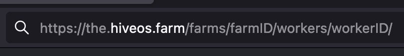
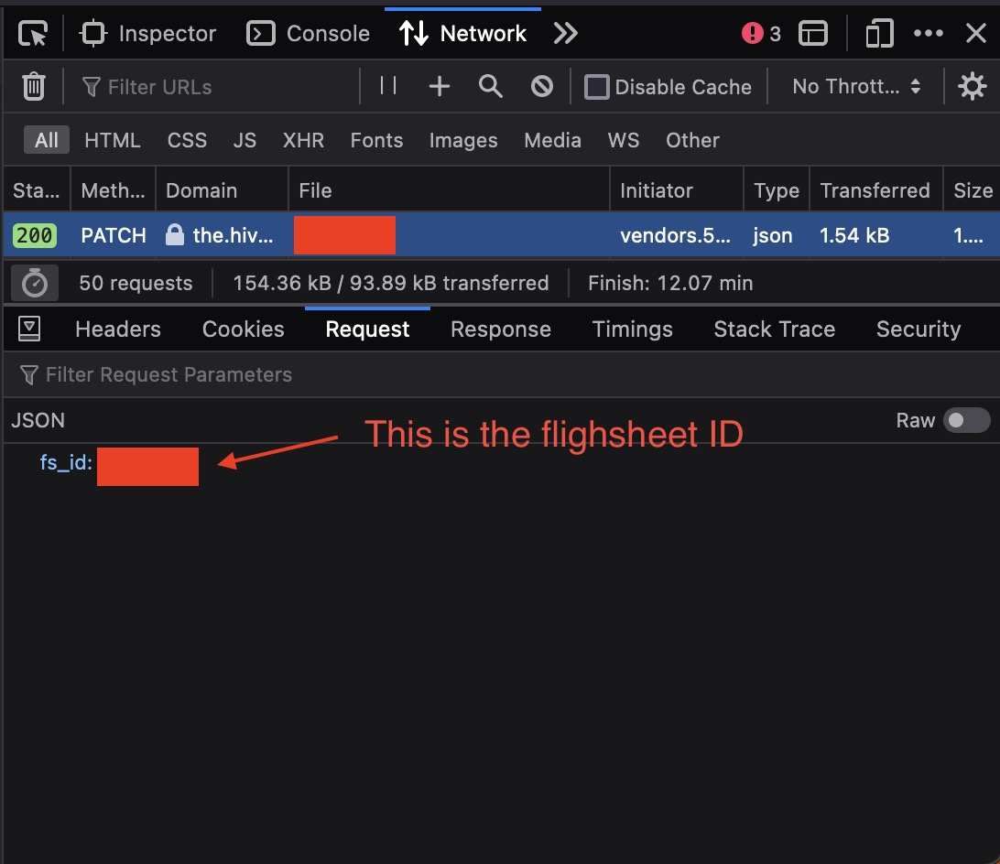

# HiveOS ZIL Autoswitcher

This is a shell script you can use to switch between mining your primary algo and a ZIL flightsheet just before the ZIL mining window starts. This can be useful in cases where the +ZIL configuration has lower hashrate than then same config without ZIL (for example NEXA).

## Install

You can use it by cloning the repo and setting up a service in your preffered distro or you can use the provided Docker image:

```shell
$ docker run -d -e "HIVEOS_API_URL=$url" \
  -e "HIVEOS_AUTH_TOKEN=token" \
  -e "PRIMARY_AND_ZIL_FS=number" \
  -e "PRIMARY_FS=number" \
  ghcr.io/karamoshi-nakatoto/hiveos-zil-autoswitcher:latest
```

Or the provided `docker-compose.yml` file:

```shell
$ docker-compose up
```

For explanation about the required environment variables, check out `.env.schema`

## Environment variables

In order for the script to work, you need to provide a few environment variables:

- `HIVEOS_API_URL` - A URL of the format `https://the.hiveos.farm/api/v2/farms/$farmID/workers/$workerID` where farmID nad workerID can be found in the URL when you access the HiveOS Web UI:



- `HIVEOS_AUTH_TOKEN` - You can generate this token by going to Account -> Sessions -> Generate new Personal API-token

- `PRIMARY_AND_ZIL_FS` and `PRIMARY_FS` - These are the IDs of the two Flightsheets the script will be switching between. `PRIMARY_FS` is the FS your miner will be running most of the time and `PRIMARY_AND_ZIL_FS` is usually a dual mining FS which is only used for a few minutes during each ZIL mining window.

You can find them by using the Network panel in the browser inspector:

1. Open the HiveOS Web UI and navigate to your worker
2. Navigate to your worker and open the Flightsheets tab
3. Open the browser inspector and go to the Network tab
4. Press the rocket button on the FS which you want to find the ID for
5. Look for a PATCH request with a URL like `https://the.hiveos.farm/api/v2/farms/$farmID/workers/$workerID` and click on it
6. Open the Request tab and you will find the ID of the current Flightsheet


